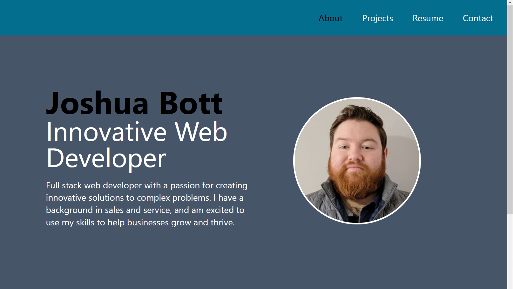

# Dev Portfolio

## Description

Dev Portfolio is a full stack web application showcasing my skills, projects, and experience as a web developer. The application allows users to view information about my background, browse through my projects, and get in touch with me. Building this project allowed me to demonstrate my proficiency with various web technologies, and design a user-friendly, aesthetically pleasing portfolio.

## Table of Contents

- [Installation](#installation)
- [Usage](#usage)
- [Technologies](#technologies)
- [License](#license)
- [Contributors](#contributors)
- [Contributing](#contributing)
- [Questions](#questions)

## Installation

No installation is required to view this project. Simply navigate to the deployed [Web Application](https://josh4got.github.io/Dev-Portfolio/) to explore my portfolio.

## Usage

To explore my portfolio, follow these simple steps:

1. Navigate to the deployed Web Application
2. Browse through the different sections to learn about my skills, projects, and background.
3. Get in touch with me using the contact form if you have any questions or inquiries.

## Technologies

The Dev Portfolio project utilizes the following technologies:

- [React](https://reactjs.org)
- [Node.js](https://nodejs.org/en)
- [Express.js](https://expressjs.com/)
- [GraphQL](https://graphql.org/)
- [Apollo Server](https://www.apollographql.com/)
- [MongoDB](https://www.mongodb.com/)
- [Tailwind CSS](https://tailwindcss.com/)
- [Font Awesome](https://fontawesome.com/)

## License

The Dev Portfolio project is licensed under the MIT License. See the [LICENSE](LICENSE) file for more details.

## Contributors

- [Joshua Bott](https://github.com/josh4got)

## Contributing

If you would like to contribute to this project or have any suggestions, please feel contact me via the questions section of the readme

## Questions

If you have any questions or would like to get in touch, please feel free to email me at [joshbottied1@gmail.com](mailto:joshbottied1@gmail.com).
